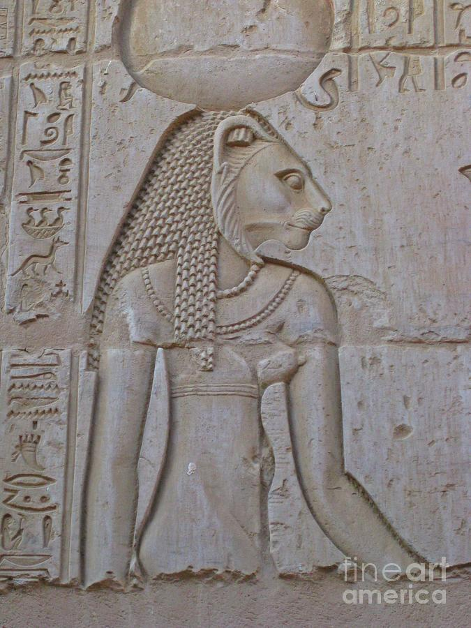

# From Papyrus to Pixels: 
## Symbols rule your world.

Symbols rule your world. They always have.

From the moment you wake up, your brain translates squiggles into meaning. 
A "STOP" sign on your commute - six simple lines that could save your life. 
A heart emoji from your crush - your pulse quickens.

Symbols are everywhere, silently shaping your reality.

Here's the kicker: your computer speaks a two-letter language; 0 and 1.
Binary code is a far cry from the 1,000 hieroglyphs used by ancient Egyptians and even more efficient than the 26 letters of the Latin alphabet. 
Gottfried Leibniz, the creator of binary code, called it divine. He wasn't exaggerating.
This digital dialect processes, stores, and transmits everything in your modern life. From your morning alarm to your goodnight text.

Now, we're on the brink of a new symbolic revolution. 
Machine learning transforms concepts like "happy" or "democracy" into a precise list of numbers. These values, known as vectors, are the numerical representation of the meaning we assing those word. 

It is one of most profound inventions of our time.

It's how chatGPT became smarter than a 5th grader.

The tale of writing is the story of human progress itself. It's a reminder that the symbols we use don't just record our thoughts - they shape how we think.

In this post, we'll journey through time and technology. 
We'll uncover the flow of information and peek into a future where the line between human and machine blurs even further.

---

## 5000 Years and Still Talking

Look at this:

[^1]

[^1]: This isn't just a pretty picture. It's an ancient Egyptian hieroglyph of Bastet.

What do you see? A cat? A goddess? Or just scribbles?

Your answer reveals more about you than the symbols themselves.

To an Egyptologist, it's a portal to ancient rituals. To a cat lover, it's a familiar friend. To my girlfriend "Kat", it's her name come to life.

One symbol. Infinite interpretations.

That's the tragic magic of abstraction.

---

## Abstraction bites

Your garage can park 10 cars. Or can it?

In the digital realm, the number 10 isn't always ten. It could be two. Or even sixteen. 
Welcome to the secret syntax of silicon, where numbers play dress-up.

1. Decimal: The numbers you know. 0 to 9.
2. Binary: The computer's mother tongue. Just 0s and 1s.
3. Hexadecimal: The space-saver. 0-9 plus A-F.

These systems are like different translations, each expressing the same concepts uniquely. Just as "dog," "perro," and "chien" all refer to the same animal, these number systems represent the same values in different forms.

Binary is the dialect of computers. You use it every day. It powers your phone, your computer, your car. Yet you've never seen it.
Picture this: You snap a selfie at the beach. In that split second, your phone transforms your sun-kissed face into a string of zeroes and ones.
That catchy tune you can't get out of your head? A dizzying waltz of 0s and 1s. 
Even this text you're reading right now - it's all binary code behind the curtains.

Symbols are bridges. They connect ideas to reality. But they crumble without a shared foundation.
A hieroglyph without context? Just a pretty squiggle. 
Binary without the base? Meaningless ones and zeros.

By grasping these different number systems, you're not just learning about computers. You're gaining insight into how we, as humans, use symbols to communicate and understand our world. 
Let's take a step back and see how we got here.

---

## From scribe to screen

Ancient Egyptians spent hours etching tiny bird masterpieces. You type 'bird' in 0.3 seconds. That's progress.
What changed?

In 660 BCE, Egyptian scribes revolutionized writing. They ditched detailed drawings for quick cursive lines. Writing time plummeted by over 99%.

This shift sparked a global race for efficiency. The Phoenicians, Greeks, and Romans each took their turn, refining symbols into better abstractions of reality. Result? Our modern alphabet. 26 letters. Infinite words. Zero birds harmed.

But the evolution didn't stop there. With the advent of block printing and later, Gutenberg's movable type press, the very shape of letters began to change. The flowing, connected scripts optimized for quick handwriting gave way to clear, distinct letterforms. Sans-serif fonts emerged, prizing ease of comprehension over flair.

From cave paintings to the printing press, humanity has always looked for ways to communicate more efficiently.

---

## The Printing Press goes digital

> "He who controls the [symbols] controls the universe." - Alia, Dune

In 1450, Gutenberg's press slashed book prices by 300 times. Religions spread like wildfire, and rulers tightened their grip.

But that was nothing.

The internet? It made information sharing virtually free.

Now, 4.66 billion people can spark revolutions or make your aunt's steamy romance novels go viral. From the Arab Spring to Facebook posts toppling regimes, the digital world's got teeth. 

And who knows? Your aunt's bodice-ripper could be the next sensation. How's that for progress?

What's the secret to making this possible? SGML, ahem, XML, I mean... HTML.

---

## Power to the publisher

HTML, CSS, and JavaScript. They're not just tools; they're the very fabric of our online world; the bridge between raw binary data and the visually appealing websites we interact with.

- HTML: The skeleton of the internet. It's everywhere, from the website you're reading to the email in your inbox. It's the lingua franca of the digital realm, structuring information across billions of devices.
- CSS: The stylist. It transforms raw data into visual feasts, making the internet not just functional, but beautiful.
- JavaScript: The puppet master. It breathes life into static pages, creating the dynamic experiences we've come to expect.

Together, they're the semantic layer of the internet.
Master these, and you're not just coding - you're getting hands on the future of global communication.

> As Alan Kay said, "The best way to predict the future is to invent it."

With HTML, CSS, and JavaScript, you have the power to do just that. For now...

---

## From Numbers to Knowledge: Vector Embeddings

Picture a world where love isn't just a four-letter word, but a string of numbers: [0.42, 0.96, ..., 0.31]. Sounds cold? Welcome to the icy, beating heart of machine intelligence.

In this world, words play a game of multidimensional chess. "King" and "queen" are neighbors on a vast board. Move "king" towards "woman," and voila! You're in "queen" territory. It's like a linguistic GPS.

But here's where it gets mind-bending: "Paris" plus "Germany" minus "France" equals... "Berlin"! This isn't magic; it's vector embeddings at work. It's how your phone seems to read your mind, finishing your sentences. It's the secret sauce behind Google's ability to translate between 100 languages in the blink of an eye.

Suddenly, abstract ideas become as tangible to machines as apples and oranges are to us. They're not just processing words; they're grasping concepts, relationships, even the nuances of human knowledge. They capture the meaning directy into math.

As you read this, machines are becoming grandmasters of language, playing on a board so vast we can barely comprehend it. They are mastering our symbols, and if we're not careful, they might just master us.

---

## The New Frontier: Machine Learning and You

AI isn't science fiction. It's here, and it's on the war path to change everything.

From your Netflix recommendations to self-driving cars, machine learning is reshaping our world. It's creating jobs that didn't exist yesterday.

Because just as the alphabet revolutionized ancient civilizations, these digital symbols—binary, HTML, vectors—are shaping our future.

The world has always been ruled by those who master symbols. Yesterday, it was priests and state figurheads with their scribes and scholars. Today, it's governments and CEOs with their programmers and data scientists.

Tomorrow? It could be you. 

Because in this new world, the pen isn't just mightier than the sword—it's mightier than ever before.

And it's waiting for you to pick it up.